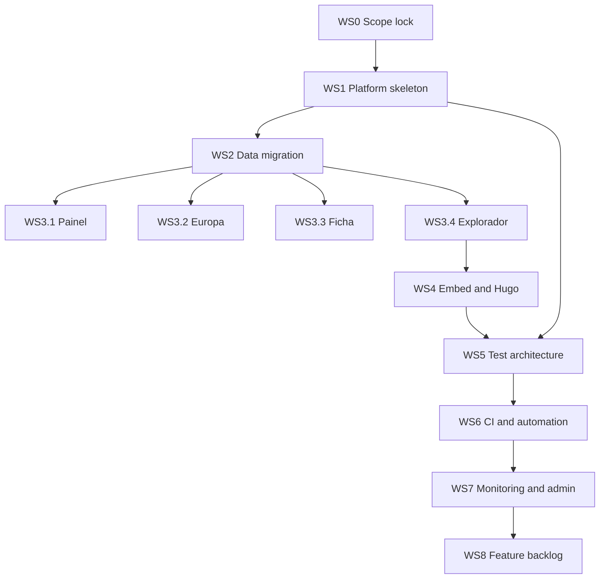

# Prumo Roadmap Consolidation

## Context snapshot

- Repository remote is confirmed as `joaompfp/prumo` via `.git/config`.
- Existing architecture and active plans reviewed in:
  - `README.md`
  - `docs/PLAN-V7.md`
  - `docs/PRUMO-ROADMAP.md`
  - `PHASE_1_SUMMARY.md`
  - `PHASE_2_FRONTEND_TESTING.md`
  - `PHASE_3_CI_CD_AUTOMATION.md`
  - `PHASE_4_MONITORING.md`
  - `MIGRATION_RUNBOOK.md`
- Shared ChatGPT URL could not be fetched from this environment due Chromium sandbox restrictions.

## Roadmap objective

Deliver a stable v7 data platform centered on 4 sections (Painel, Europa, Explorador, Ficha Técnica), preserve backward compatibility where required, and operationalize testing + observability.

## Guiding constraints

1. Keep deprecated endpoints operational until explicit decommission decision.
2. Separate concerns:
   - DuckDB for read-heavy indicator data
   - SQLite for analytics/events
3. Ship in deployable increments with validation gates.
4. Make frontend state shareable via URL and reproducible.
5. Make quality measurable before new feature expansion.

## Workstreams and ordered execution

### WS0 — Alignment and scope lock

**Outcome**: single source of truth for what is in-scope for this execution cycle.

Tasks:
- Consolidate `docs/PLAN-V7.md` and `docs/PRUMO-ROADMAP.md` into one active backlog doc.
- Classify each item as:
  - Platform foundation
  - UX/data feature
  - Reliability/ops
  - Experimental backlog
- Freeze explicit non-goals for this cycle.

Exit criteria:
- Approved backlog with clear include/exclude list.

---

### WS1 — Platform skeleton and API baseline

**Outcome**: deployable 4-tab shell with stable API contracts.

Tasks:
- Keep only v7 primary sections in UI shell:
  - Painel
  - Europa
  - Explorador
  - Ficha Técnica
- Ensure these contracts are stable and documented:
  - `GET /api/resumo`
  - `GET /api/compare`
  - `GET /api/catalog`
  - `GET /api/series`
  - `GET /api/export`
  - `POST /api/track`
  - `GET /api/stats`
- Add deprecation headers for legacy endpoints instead of removing them.
- Ensure `healthz` remains Docker/Traefik-safe.

Dependencies:
- WS0

Exit criteria:
- API map in docs matches implementation.
- 4-tab shell loads and routes correctly.

---

### WS2 — Data and storage migration hardening

**Outcome**: data path ownership is correct and migration is reversible.

Tasks:
- Execute migration via runbook discipline from `MIGRATION_RUNBOOK.md`.
- Validate mounted `/data` behavior for first-run bootstrap idempotency.
- Confirm DuckDB location ownership under Prumo appdata path.
- Preserve rollback pack and checksum manifest before cutover.

Dependencies:
- WS1

Exit criteria:
- Health checks pass on both primary and alias routes.
- No overwrite of existing site and ideology files.
- Rollback rehearsal validated.

---

### WS3 — Section delivery sequence

**Outcome**: each v7 section reaches production-ready baseline.

#### WS3.1 Painel
- Keep KPI cards + sparklines + trend and YoY semantics.
- Remove narrative coupling and cross-section CTA noise.
- Add prominent updated timestamp.

#### WS3.2 Europa
- Progressive disclosure UI: presets first, custom country picker second.
- URL state persistence and shareable permalink.
- Coverage matrix for direct DB-backed indicators vs legacy path.

#### WS3.3 Ficha Técnica
- Full source and indicator reference from catalog metadata.
- Explicit methodology section and source links.
- Deep links into Explorador for each indicator.

#### WS3.4 Explorador
- Searchable multi-indicator workflow.
- Smart axis strategy by unit compatibility.
- Table toggle + CSV export + shareable state.

Dependencies:
- WS1, WS2

Exit criteria:
- All 4 sections functionally complete at baseline level.
- Section contracts verified against API responses.

---

### WS4 — Embed and external publishing integration

**Outcome**: charts can be embedded in external pages and Hugo content.

Tasks:
- Build standalone `embed.js` with:
  - auto ECharts loader
  - `.cae-embed` discovery
  - responsive rendering and fallback states
  - event tracking via `/api/track`
- Serve `/embed.js` with safe cache + CORS headers.
- Add Hugo shortcode and conditional script loading.
- Add one draft reference post exercising the shortcode.

Dependencies:
- WS3.4

Exit criteria:
- Sample embed renders outside dashboard context.
- Hugo draft page renders embedded chart.

---

### WS5 — Test architecture completion

**Outcome**: testing depth covers backend + frontend + integration contracts.

Tasks:
- Preserve and extend Phase 1 backend test base.
- Implement Phase 2 frontend state and component tests with vitest.
- Add contract tests for:
  - `/api/export`
  - `/api/track`
  - `/api/stats`
  - permalink hash parsing/restoration
- Define minimum gating suite for every PR.

Dependencies:
- WS1 through WS4 (incrementally)

Exit criteria:
- CI baseline green on backend and frontend suites.
- Contract regressions fail fast in CI.

---

### WS6 — CI/CD and operations automation

**Outcome**: repeatable quality and operational feedback loops.

Tasks:
- Implement GitHub workflows for push, nightly, and freshness checks.
- Produce consolidated artifact/report outputs.
- Keep secrets and delivery channels externalized.
- Ensure failing freshness checks trigger alert path.

Dependencies:
- WS5

Exit criteria:
- Push workflow required for merge.
- Nightly report pipeline operational.

---

### WS7 — Runtime observability and admin insight

**Outcome**: production behavior is measurable and actionable.

Tasks:
- Add robust `/health` endpoint with dependency-level status.
- Add protected `/admin/usage` API/dashboard surface.
- Integrate request/error/performance counters with analytics DB.
- Optionally integrate Umami stack for visitor analytics.

Dependencies:
- WS6

Exit criteria:
- Health contract consumed by ops tooling.
- Usage insights available for endpoint, language, and error trends.

---

### WS8 — Feature backlog after platform stabilization

**Outcome**: controlled expansion after core platform quality gates are met.

Candidate items from existing brainstorm:
- PT vs Europa and PT vs Mundo AI analysis overlays
- Missing collectors and retry strategy for failed series
- Snapshot ranking improvements and PT highlight
- Table mode refinements in comparators
- Chart PNG export improvements
- Persistent AI analysis cache beyond Painel

Dependencies:
- WS3 through WS7 complete and stable

Exit criteria:
- Feature intake only after stability thresholds are sustained.

## Dependency diagram

## Handoff checklist for Code mode

1. Start with WS0 and produce/update one canonical roadmap doc in `docs/`.
2. Implement WS1 and WS2 as first PR batch with explicit rollback notes.
3. Deliver WS3 in section-sized PRs to minimize blast radius.
4. Deliver WS4 only after Explorador contract is stable.
5. Introduce WS5 test gates before scaling WS8 features.
6. Keep deprecation policy explicit in API docs and response headers.

## Risks to track

- Drift between roadmap docs and actual endpoint behavior.
- Feature work starting before contract and test stabilization.
- Data migration shortcuts bypassing runbook safety gates.
- Legacy endpoint consumers breaking if deprecation handling is weak.

## Decision required from user

Because shared ChatGPT link content was not retrievable in this environment, this roadmap is grounded in repository sources. A reconciliation pass should be done after the shared text is provided in raw form.
