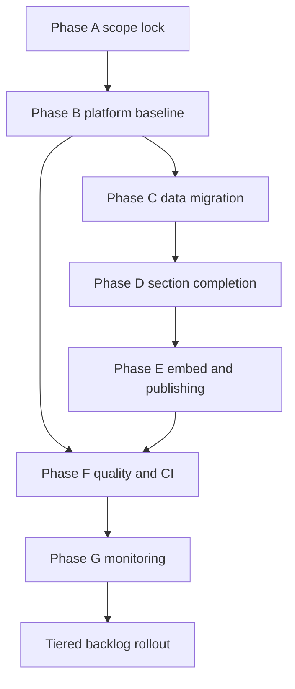

# Prumo — Actionable Roadmap

## 1) Scope and intent

Build and stabilize Prumo as a 4-section data platform:
- Painel
- Comparativos
- Explorador
- Ficha Técnica

Keep backward compatibility where needed, then phase in feature expansion from brainstorm backlog.

## 2) Delivery principles

1. Contract first: endpoint behavior documented and testable before UI polish.
2. Incremental deploys: every phase must be independently deployable.
3. Safe migration: follow runbook gates and rollback readiness.
4. Backward compatibility: deprecate with headers before removals.
5. Stability before expansion: feature backlog starts only after quality gates are green.
6. Public API hardening is mandatory: caching headers, CORS policy, limits, and abuse controls are first-class scope.

## 3) Phased execution plan

### Phase A — Foundation and scope lock

Goal: one approved source of truth and clear boundaries.

Actions:
- Consolidate active scope into this file.
- Mark non-goals for the current cycle.
- Confirm final endpoint ownership per section.

Exit gate:
- Approved scope table and dependencies map.

---

### Phase B — Platform baseline

Goal: deployable 4-tab shell and stable API baseline.

Actions:
- Keep v7 shell focused on Painel, Europa, Explorador, Ficha Técnica.
- Keep and document baseline endpoints:
  - `GET /api/resumo`
  - `GET /api/compare`
  - `GET /api/catalog`
  - `GET /api/series`
  - `GET /api/export`
  - `POST /api/track`
  - `GET /api/stats`
- Keep deprecated endpoints operational with explicit deprecation headers.
- Validate `healthz` behavior for container and reverse proxy checks.
- Implement P0 hardening from technical review:
  - ETag for idempotent endpoints (`/api/resumo` or `/api/panel`, `/api/catalog`, `/api/series`)
  - `Cache-Control` per endpoint profile
  - `X-Data-Version` response header on `/api/*`
  - strict parameter validation and whitelists (no raw SQL surfaces)
  - max date range and export size caps
  - CORS split/restriction for production origins and POST paths

Exit gate:
- 4-tab shell working, endpoint map aligned with docs.
- Caching and guardrail headers observable on target endpoints.

---

### Phase C — Data migration hardening

Goal: data location ownership, idempotent bootstrap, fast rollback.

Actions:
- Execute cutover using `docs/operations/MIGRATION_RUNBOOK.md` gates.
- Validate `/data` bootstrap does not overwrite existing local state.
- Confirm DuckDB path ownership under Prumo appdata.
- Preserve checksumed backups before cutover.
- Add ETL reliability upgrade plan:
  - build validated `*_new.duckdb`
  - atomic swap to active DB file/symlink
  - API remains read-only against stable active DB

Exit gate:
- Health checks pass on primary and alias routes.
- Rollback rehearsal validated.
- No partial-state reads during or after ingestion cutover.

---

### Phase D — Section completion

Goal: production baseline for each of the 4 core sections.

#### D1 Painel
- Keep KPI cards, sparkline, trend and YoY semantics.
- Remove narrative coupling and cross-section noise.
- Show prominent updated timestamp.

#### D2 Europa
- Progressive disclosure UI with presets first and custom selection second.
- Persist URL state and add share permalink.
- Produce indicator coverage matrix direct DB path versus legacy path.

#### D3 Ficha Técnica
- Full indicator and source reference from catalog metadata.
- Methodology and source links visible.
- Deep links to Explorador preselection state.

#### D4 Explorador
- Searchable multi-indicator selection.
- Smart axis logic by unit compatibility.
- Table toggle, CSV export, permalink state.

Exit gate:
- Functional parity baseline complete for all 4 sections.

---

### Phase E — Embed and external publishing

Goal: embeddable charts beyond dashboard shell.

Actions:
- Deliver standalone `embed.js`:
  - auto-load ECharts
  - discover `.cae-embed`
  - render responsive charts
  - fire-and-forget tracking via `/api/track`
- Serve `/embed.js` with cache and CORS policy.
- Add Hugo shortcode and conditional script loading.

Exit gate:
- External embed and Hugo draft render verified.

---

### Phase E2 — SEO, resilience, and accessibility fallback

Goal: degraded mode UX and preview resilience without JS.

Actions:
- Add minimal SSR endpoint `GET /dados/painel` proxied to FastAPI.
- Render top indicators table sourced from stable server-side view.
- Include `<noscript>` guidance and direct JSON/CSV links.

Exit gate:
- `/dados/painel` usable without client JS and suitable for preview/accessibility fallback.

---

### Phase F — Quality and CI gates

Goal: measurable quality and regression control.

Actions:
- Extend backend tests from Phase 1 base.
- Add frontend state and component tests from Phase 2 plan.
- Add contract tests for:
  - `/api/export`
  - `/api/track`
  - `/api/stats`
  - hash-permalink restore
- Add non-functional contract tests:
  - ETag `If-None-Match` path returns `304`
  - `Cache-Control` policy matrix by endpoint
  - `X-Data-Version` present on `/api/*`
  - out-of-policy ranges and oversized exports return clear `400`
- Enable push workflow and nightly/freshness automation.

Exit gate:
- CI required for merge and nightly reports operational.

---

### Phase G — Monitoring and operations insight

Goal: actionable observability and admin visibility.

Actions:
- Add robust `/health` dependency-level status.
- Add protected `/admin/usage` with endpoint, language, error and performance rollups.
- Optionally integrate Umami for visitor analytics.
- Add Nginx/API abuse controls in deployment layer:
  - `limit_req` for `/api/*` with stricter export thresholds
  - static asset immutable caching for hashed files
  - security headers baseline (`nosniff`, HSTS where applicable)

Exit gate:
- Health and usage surfaces available to operations.

## 4) Backlog integration from feature brainstorm

### Tier 1 — Next after stabilization

1. PT vs Europa and PT vs Mundo AI analysis overlays
2. Missing collector retries:
   - `BX.KLT.DINV.WD.GD.ZS`
   - `SE.TER.ENRR`
   - optional CO2, electricity access, infant mortality
3. Snapshot ranking with PT highlight and EU median marker

### Tier 2 — High-value UX and analyst workflows

1. PNG export button for ECharts
2. Persistent AI cache extension beyond Painel
3. Table mode improvements in comparators
4. PT plus reference differential in Mundo view
5. Income distribution indicators Gini and S80/S20

### Tier 3 — Experimental and strategic

1. Publication alerts for key indicators
2. Political events timeline overlays
3. Detailed labor indicators
4. Sectoral PT vs EU exports comparison
5. Presentation fullscreen mode

Rule:
- Tier 1 work starts only after Phase F gate is green.
- Tier 2 and Tier 3 depend on sustained stability and backlog review.

## 5) Dependency map

## 6) Actionable execution checklist

1. Approve this merged roadmap as canonical.
2. Implement Phase B P0 hardening before feature-facing expansion.
3. Implement Phase C migration hardening with atomic ETL swap approach.
4. Deliver Phase D section-by-section to reduce blast radius.
5. Add Phase E2 SSR fallback before broad communications or SEO work.
6. Gate feature expansion behind Phase F completion.
7. Revisit backlog tiers after first stable monitoring cycle.

## 7) Definition of done for merged roadmap

### Caching and traceability
- Conditional requests return `304` where applicable.
- `Cache-Control` is present and endpoint-specific.
- `X-Data-Version` is visible on `/api/*` responses.

### Safety and hardening
- CORS is explicit by origin and route class.
- Date-range and export-size limits are enforced.
- Rate limiting protects high-cost endpoints.

### Reliability and resilience
- ETL publishes atomically without exposing partial DB state.
- `GET /dados/painel` provides a usable non-JS fallback.

## 8) Strategic evolution to global multilingual platform

Long-term vision:
- become a multilingual open political and socio-economic intelligence platform
- support both multilingual interface and multilingual generated analysis
- expand data coverage from Portugal/EU to global scope with transparent provenance

### Evolution track A — Multilingual product foundation

1. Internationalization architecture
- Extract all UI strings into locale dictionaries and translation keys.
- Define language fallback chain and locale formatting rules.
- Add language switcher state to URL and persisted client preferences.

2. Multilingual content generation
- Store generated analyses with `language`, `model_id`, `prompt_version`, `input_hash`, `data_version`.
- Build translation-quality policy per language:
  - native generation when model quality is high
  - controlled translation workflow when native quality is lower
- Add per-language moderation and safety filters.

3. Acceptance gate
- Same analysis request is reproducible in multiple languages with explicit provenance.
- No UI strings hardcoded outside localization layer.

### Evolution track B — Global data expansion

1. Source onboarding framework
- Define source certification checklist: license, cadence, API stability, metadata quality.
- Add source-level quality score and freshness score in catalog.
- Standardize source adapters with unified schema contracts.

2. Comparative geography model
- Move from region-specific assumptions to generic geography dimensions:
  - country
  - region bloc
  - subnational when available
- Support comparable metric mapping across institutions.

3. Acceptance gate
- New region onboarding is configuration-driven with minimal code churn.
- Cross-country comparisons remain explainable and auditable.

### Evolution track C — Governance, credibility, and openness

1. Editorial transparency
- Publish methodology pages and known limitations by dataset.
- Expose confidence notes and revision history for major indicators.

2. Community and contribution model
- Add contributor pathways for:
  - new collectors
  - language packs
  - chart modules
  - methodology reviews
- Define review workflow for politically sensitive content.

3. Legal and ethical safeguards
- Data licensing matrix per source.
- Clear policy for generated political analysis with reproducibility requirements.

4. Acceptance gate
- Public trust artifacts available: provenance, methods, revisions, and contribution audit trail.

### Evolution track D — Scale architecture

1. API productization
- Introduce versioned API contracts for external consumers.
- Add usage tiers and stricter anti-abuse controls for high-cost queries.

2. Search and discovery
- Build global catalog search by topic, geography, source, and frequency.
- Add semantic discovery for related indicators and narratives.

3. Delivery channels
- Maintain embeddable charts and add dataset pages suitable for indexing.
- Add periodic machine-readable snapshots for open data reuse.

4. Acceptance gate
- Platform supports global read traffic growth while preserving deterministic outputs.

## 9) Expansion backlog tiers beyond current Tier 1 to Tier 3

### Tier 4 — Multilingual rollout
- Core UI locales and locale QA pipeline
- Multilingual generated analysis provenance pipeline
- Language-specific glossary for economic and political terms

### Tier 5 — Global source network
- Regional source packs for Americas, Africa, Asia, and Middle East
- Source reliability scoring dashboard
- Cross-source harmonization playbooks

### Tier 6 — Open political intelligence platform
- Public methodology registry and revision ledger
- Contributor governance and review board process
- Open API ecosystem documentation and external integration examples
